# flybrain-reservoir

[](https://github.com/MilanKalajdzic/flybrain-reservoir/actions/workflows/tests.yml)

**Does a real fruit fly brain make a better forecasting machine than random wiring?**

<p align="center">
  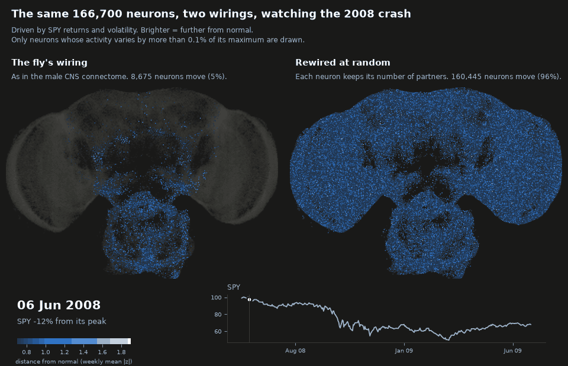
</p>

*All 166,700 neurons of the male fly CNS during the 2008 crash, driven by SPY returns and volatility
through its sensory neurons. Left: wired exactly as in the connectome. Right: the same neurons with
every connection rewired at random, each neuron keeping its number of partners. Brighter = further
from that neuron's normal activity. Only neurons whose activity varies by more than 0.1% of its
maximum are drawn: 5% of the fly's, against 96% of the rewired brain's. That's the main result in
one picture: the fly's dense knots set the volume, and at that volume most of its brain barely
moves. Both react to the crash; neither sees it coming.
([COVID version](docs/img/brain_COVID_whole_cns.gif) · [the 3,000-neuron circuit](#what-the-fly-does-with-the-market))*

This project uses the wiring diagram of the adult male *Drosophila* central nervous system
(166,700 neurons, released in 2026 by FlyEM/HHMI Janelia with Google Research) as the recurrent
network of an echo state network, feeds it market data, and compares it against control
networks that keep some of its statistics and scramble the rest.

The goal isn't to beat the market with a fly. It's a clean answer to a narrower question: *is
biological wiring special as a reservoir, compared to random wiring with matching statistics?*

**Contents:** [Short version](#short-version) · Results: [markets](#markets-no-edge) ·
[memory](#memory-the-fly-remembers-the-least) · [hot spots](#why-hot-spots) ·
[best gains](#each-wiring-at-its-own-best-gain) · [per region](#each-brain-region-its-own-gain) ·
[per neuron](#each-neuron-its-own-gain) · [NARMA-10](#a-second-benchmark-narma-10) ·
[robustness](#robustness-moving-the-input-slowing-the-neurons) · [FlyWire](#a-second-fly-flywire) ·
[volatility](#volatility-a-question-with-an-answer) · [the fly's activity](#what-the-fly-does-with-the-market)
· [How it works](#how-it-works) · [Setup](#setup) · [Running it](#running-it-on-the-real-brain) ·
[Design decisions](#design-decisions-and-why) · [Limitations](#limitations) · [Credits](#data-and-credits)

## Results

SPY daily, out of sample Sep 2007 to Mar 2026 (the configs pin the last day, so reruns give the same
numbers). Two scales: a 3,000-neuron circuit grown from the sensory neurons (`configs/small.yaml`,
5 seeds) and the whole CNS, brain plus nerve cord, 166,700 neurons (`configs/full.yaml`, 10 seeds;
"whole brain" below, for short). The gain sweeps, per-region and per-neuron gains, NARMA-10 and the
robustness checks use 3 seeds. `scripts/report.py` prints the headline tables from the result
folders; each script's `summary.md` has the rest.

### Short version

- **Markets:** no edge at either scale, and the wiring doesn't matter.
- **Memory:** the fly remembers the least. Its wiring is a set of dense knots, one inside almost
  every brain region, and a reservoir can't drive them all at once. Across the whole brain it ends
  up 8–11× behind random wiring, even with every wiring at its own best gain; in the male CNS's
  small circuit the best gains bring it level.
- **Finer tuning doesn't rescue it.** A gain per brain region helps random wiring far more than the
  fly. A gain per neuron helps every wiring in the small circuit but mostly makes the fly latch, and
  across the whole brain it widens the gap to about 10×. A second benchmark, NARMA-10, agrees.
- **Robust:** feeding the input into random neurons or slowing the neurons down leaves the fly far
  behind across the whole brain. The one exception, slow neurons in a small circuit, is fragile.
- **Replicated:** FlyWire's female brain, a second, independent connectome, has the same knots in the
  same order and the same whole-brain deficit. The male CNS small-circuit tie doesn't replicate.
- **Volatility:** every reservoir beats the standard HAR benchmark by about 17% at a 5-day horizon,
  but a linear model with the same inputs already gets 15 of those 17 points, and the wiring moves
  the result by about 1 point.

<p align="center">
  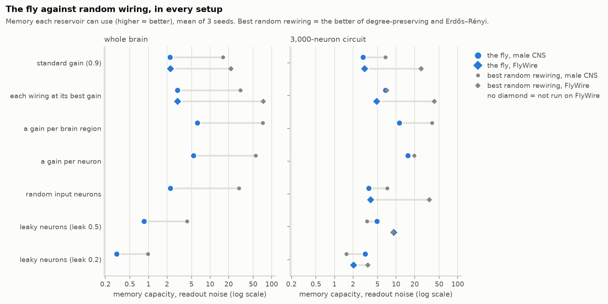
</p>

*Every memory result in one chart: blue is the fly's wiring, gray the better of the two random
rewirings, on a log scale, so the length of each bar is how many times more one remembers than the
other (`scripts/scoreboard.py`). Circles are the male CNS, diamonds FlyWire, which got the gain sweep
at both scales and the robustness checks in the small circuit. Per-neuron gains are the mean over
seeds, including ones where the fly latches.*

### Markets: no edge

No edge at either scale, and the wiring doesn't matter. Every reservoir has an IC around 0.015 (t ≈
1), a hit rate around 53.5%, below the 55.1% you get by always being long, and a Sharpe of 0.42 to
0.51 against 0.59 for buy & hold. None of the connectome-vs-control differences is larger than the
noise (the standard error of an 18½-year Sharpe is about 0.23). The equity curve's early lead over
buy & hold comes entirely from sidestepping 2008.

### Memory: the fly remembers the least

At the standard gain the fly remembers the least of the five wirings. Memory capacity counts how
many past steps of a random input a linear readout can recover ([details](#market-free-benchmarks)).
The main number adds a little readout noise, so it only counts memory a real readout could use:

| memory capacity | connectome | degree-preserving | weight shuffle | sign shuffle | Erdős–Rényi |
|---|---|---|---|---|---|
| 3,000 neurons, readout noise | **2.8** | 5.8 | 3.0 | 4.3 | 6.8 |
| whole CNS, readout noise | **2.2** | 15.5 | 2.4 | 2.9 | 7.4 |
| *3,000 neurons, noise-free* | *9.2* | *10.2* | *9.2* | *9.7* | *11.0* |
| *whole CNS, noise-free* | *14.1* | *27.7* | *15.7* | *14.0* | *16.7* |

Noise-free, the fly's whole-brain memory looks respectable, but 84% of it lives in fluctuations
smaller than a thousandth of a neuron's maximum activity. With noise, the degree-preserving shuffle
remembers 7× more.

### Why: hot spots

Every wiring is rescaled so its largest eigenvalue is 0.9. In the fly, that eigenvalue (251, against
~34 for the degree-preserving shuffle) comes from a knot of 213 neurons in the antennal lobe, the
smell center: local interneurons and projection neurons, 38% of all possible connections between
them present, 41 synapses per connection against 14 brain-wide, mostly labeled excitatory. Dividing
every weight by ~280 to tame that knot silences almost everything else: at the standard gain only 3%
of the whole-brain readouts move (by more than 0.001, under white-noise input), against 90% in the
degree-preserving shuffle. The fly's top mode is spread over ~120 neurons, the shuffle's over
~15,500. The weight and sign shuffles keep the fly's connections, so they keep its knots too (3–5%
of readouts move).

It's not one knot, either. Remove it and the next hot spot sets the gain (`scripts/hot_spots.py`,
whole CNS):

| step | largest eigenvalue | where the hot spot is |
|---|---|---|
| 1 | 251 | antennal lobe (213 neurons) |
| 2 | 206 | optic lobe |
| 3 | 178 | optic lobe |
| 4 | 173 | central brain and descending neurons |
| 5 | 148 | mushroom body (Kenyon cells, output neurons) |
| 6 | 116 | central complex |

Every brain region has its own dense core, and one global volume knob can only suit the loudest.
Normalizing each neuron's total input first (`reservoir.input_normalization: l1`) doesn't fix it:
tiny two-neuron loops then set the gain instead and 95% of the brain stays silent.

### Each wiring at its own best gain

Forcing one gain on every wiring is arbitrary, so the gain sweep (`scripts/gain_sweep.py`) tries 13
gains from 0.5 to 20 and keeps each wiring's best *valid* one: at most 1% of readouts latch onto the
distant past or go chaotic, in each of four latching tests with different inputs, for every seed.

<p align="center">
  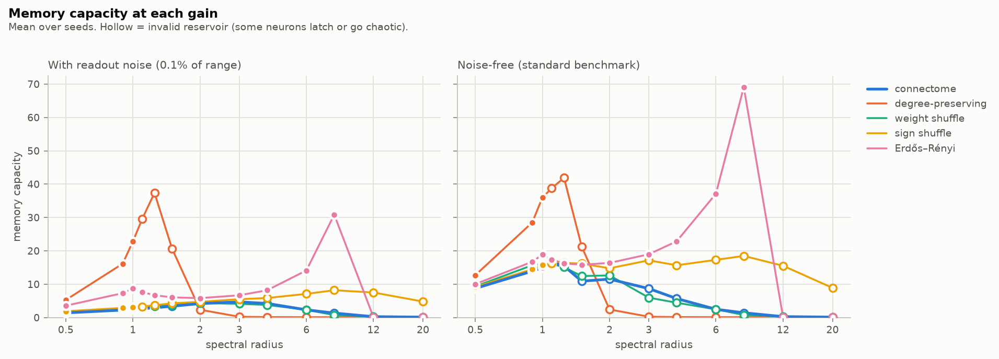
</p>

| best valid memory, readout noise (gain) | connectome | degree-preserving | weight shuffle | sign shuffle | Erdős–Rényi |
|---|---|---|---|---|---|
| 3,000 neurons | 6.7 (3) | 6.0 (1) | 7.4 (3) | 4.3 (1.1) | 7.1 (1) |
| whole CNS | **2.9** (1.25) | 22.8 (1) | 2.9 (1.1) | 3.1 (1) | 30.8 (8) |

- **3,000 neurons: a tie.** Raising the gain to 3 more than doubles the fly's memory, and four of
  the five wirings land between 6.0 and 7.4, within the seed-to-seed spread (the sign shuffle
  latches at any gain above 1.1 and stays at 4.3). In this circuit the next hot spot is much weaker
  than the antennal lobe (82 vs 251), so the gain can go up about 3× and wake most of the circuit
  (59% of readouts move) before anything latches. Noise-free, the connectome and the weight shuffle
  even come out ahead (14.0 and 14.7 vs 9.6 to 11.2), but that lead lives in tiny fluctuations and
  disappears with noise.
- **Whole brain: the fly stays far behind.** Its best is 2.9 at gain 1.25, and past that its cores
  latch: the next hot spots are close behind the first (206, 178, 173…), so there's no headroom.
  The degree-preserving shuffle reaches 22.8 and Erdős–Rényi 30.8, 8–11× more. Noise-free the
  order is the same (15.5 vs 36.0 and 69.1).
- **It's the topology.** The three wirings that keep the fly's connections (connectome, weight
  shuffle, sign shuffle) all end up near 3 (2.9 to 3.1); the two that scramble who connects to whom
  reach 23 to 31. Moving synapse counts around or changing which neurons are inhibitory doesn't help.
- Caveats on the controls' side: the degree-preserving shuffle is only valid up to gain 1 (it turns
  unstable past that), so its best sits right at the edge. Erdős–Rényi's best, at gain 8, has 90% of
  its readouts barely moving, with the memory carried by the 10% that do, and it turns invalid at
  12. At the standard gain it already has 7.4, 2.5× the fly's best.

<p align="center">
  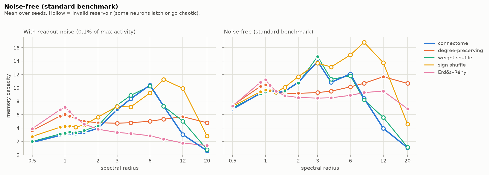
</p>

### Each brain region its own gain

A real brain isn't stuck with one volume knob: neuromodulators and local inhibition tune each
region. So the model gets the same freedom (`scripts/region_gains.py`). The neurons are split into
the anatomical regions from the activity figures (visual system, central brain, nerve cord, mushroom
body, antennal lobe, …: 9 in the small circuit, 11 in the whole CNS), each region's incoming
synapses get their own factor, and a search moves one factor at a time (×2, then ×1.41) while memory
improves and every latching test passes. It starts from the two best peaks of each wiring's
single-gain curve and picks factors on one set of white-noise inputs; every number below comes from
fresh inputs it never saw. Every wiring gets the same regions and the same search.

<p align="center">
  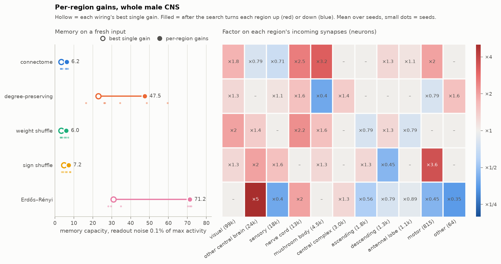
</p>

| memory with readout noise, fresh inputs | connectome | degree-preserving | weight shuffle | sign shuffle | Erdős–Rényi |
|---|---|---|---|---|---|
| 3,000 neurons, best single gain | 6.8 | 6.0 | 7.4 | 6.7 | 7.1 |
| 3,000 neurons, per-region gains | **11.3** | 32.7 | 12.1 | 12.6 | 38.1 |
| whole CNS, best single gain | 3.4 | 22.9 | 3.3 | 4.7 | 30.9 |
| whole CNS, per-region gains | **6.2** | 47.5 | 6.0 | 7.2 | 71.2 |

(Single gains here are each seed's own best, measured on the fresh inputs, so they differ from the
sweep table, which uses one gain for all seeds; most for the sign shuffle, 6.7 vs 4.3 and 4.7 vs 3.1.
The fly's whole-brain single gain is valid on the fresh inputs for 2 of 3 seeds.)

- **The fly gains about 75%, random wiring 2–5×.** In the small circuit the tie turns into a 3×
  gap (11.3 vs 32.7 and 38.1). Across the whole brain the gap stays about where it was, 8–12×
  (6.2 vs 47.5 and 71.2).
- **Same split as before.** The three wirings with the fly's connections end up together (around 12
  in the small circuit, 6 to 7 in the whole brain), the two scrambled ones far above.
- **Why it doesn't rescue the fly: the knots sit inside the regions.** Every fly region is at least
  4 times louder on its own than the same region in the degree-preserving shuffle (largest eigenvalue
  of the region's own connections: antennal lobe 252 vs 7.5, visual system 206 vs 33, rest of the
  central brain 171 vs 15, central complex 116 vs 4). A region's factor scales its knot together
  with everything around it, so after the search the fly's dominant mode still sits on ~60 neurons,
  against ~10,000 in the degree-preserving shuffle and ~14,000 in Erdős–Rényi.
- Erdős–Rényi's per-region result comes from starting at gain 1, not from its saturated best single
  gain of 8, and wakes up the whole brain (98% of readouts move, from 10%). Every per-region setting
  passes all latching tests on the fresh inputs, except one sign-shuffle seed in the small circuit.

<p align="center">
  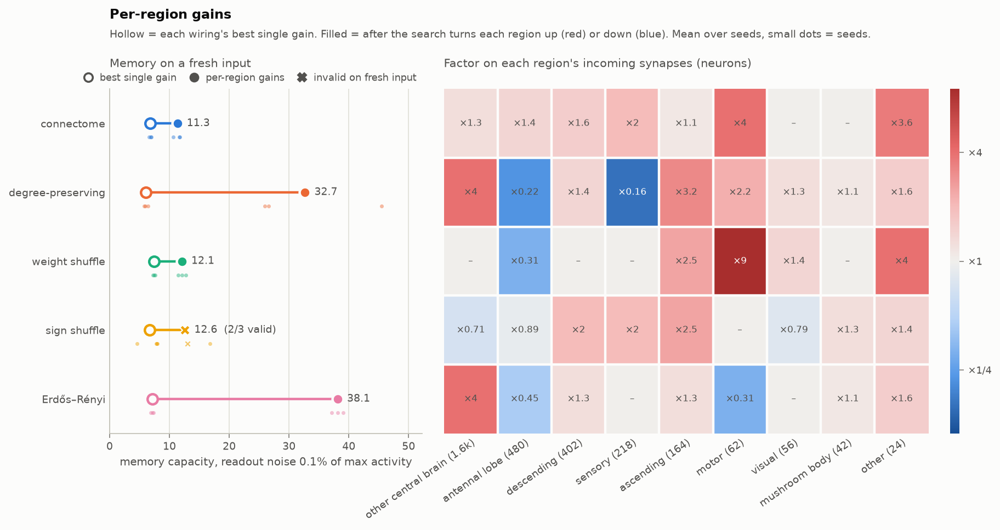
</p>

### Each neuron its own gain

Real neurons don't wait for a search: synaptic scaling multiplies all of a neuron's incoming
synapses up when it's too quiet and down when it's too busy. The model gets the same rule
(`scripts/homeostasis.py`). Drive the reservoir with white noise, measure how big each neuron's
recurrent input is, move its gain halfway toward a target, and repeat for 30 rounds. Neurons with
too much input (the knots) get turned down and quiet ones turned up, with no knowledge of anatomy.
Region averages in the figure mostly go up, since each knot is a small part of its region. Four
targets; each wiring keeps its best valid one, picked on the search inputs and reported on fresh
ones, as before.

<p align="center">
  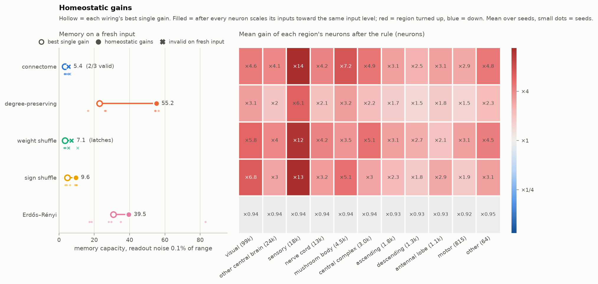
</p>

| memory with readout noise, fresh inputs | connectome | degree-preserving | weight shuffle | sign shuffle | Erdős–Rényi |
|---|---|---|---|---|---|
| 3,000 neurons, best single gain | 6.8 | 6.0 | 7.4 | 6.7 | 7.1 |
| 3,000 neurons, homeostatic | 15.4 (1 of 3 seeds valid) | 19.8 | 17.8 | 10.0 | 15.1 |
| whole CNS, best single gain | 3.4 (2 of 3) | 22.9 | 3.3 | 4.7 | 30.9 |
| whole CNS, homeostatic | **5.4** (2 of 3) | 55.2 | latches (0 of 3) | 9.6 | 39.5 |

(Mean over 3 seeds. In brackets: how many seeds end up valid on fresh inputs, when not all of them
do.)

- **Per-neuron gains don't rescue the fly either.** Across the whole brain it goes from 3.4 to 5.4,
  while the degree-preserving shuffle goes from 23 to 55: the gap widens to about 10×.
- **The fly mostly latches.** Of its 12 tries (4 targets × 3 seeds), the fly ends up valid once in
  the small circuit and twice in the whole brain; the degree-preserving shuffle 9 times at both
  scales. When the fly latches, 80–90% of the circuit locks up at once (checked on the small
  circuit), so it's a global state, not one knot.
- **Topology again, at brain scale.** In the small circuit the weight shuffle (the fly's connections,
  synapse counts shuffled) does fine, which suggested the fly's actual synapse counts were the
  problem. The whole brain doesn't back that up: there the weight shuffle never ends up valid (0 of
  12 tries) and the sign shuffle only reaches 9.6, far below the two scrambled wirings (55.2 and
  39.5). The three wirings with the fly's connections struggle; the two that scramble them don't.
- **Caveats.** The rule doesn't always settle. In these mostly excitatory networks a neuron's input
  can have no level near the target: a bit more gain tips its neighborhood into a self-sustained
  active state, a bit less drops it back. So after 30 rounds usually only a minority of neurons are
  within ×2 of the target; at the highest target it does settle, and then almost everything latches
  (2 valid of 30 tries). Two other rules collapsed first (documented in
  `src/flyres/homeostasis.py`). Erdős–Rényi's whole-brain number varies a lot between seeds
  (39.5 ± 37.6).

### A second benchmark: NARMA-10

Memory capacity only asks a reservoir to replay its input. NARMA-10 (`scripts/narma.py`), the
standard benchmark since Jaeger (2003), asks it to compute with it: the target includes the product
of the current input and the one 9 steps back, so it needs memory *and* a nonlinearity. A linear
model of the last 10 inputs gets an error of 0.60. Every wiring runs at every gain and is judged at
its best valid one, with the same readout noise as memory capacity.

<p align="center">
  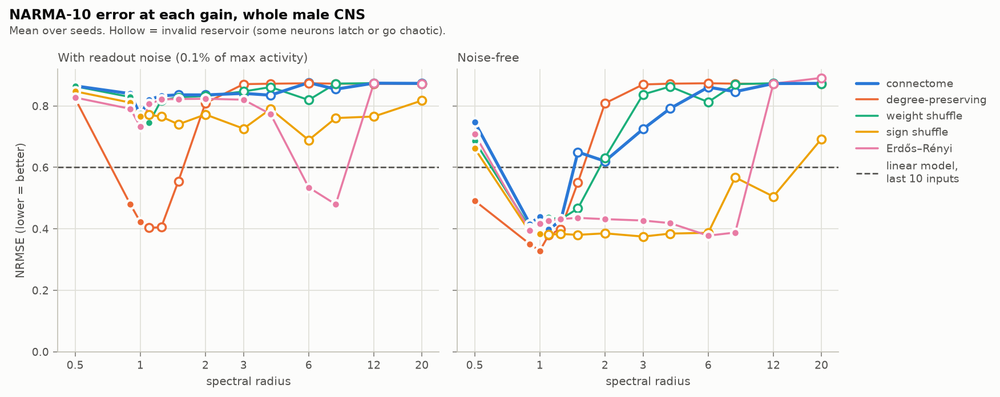
</p>

| NARMA-10 error (NRMSE, lower is better), best valid gain | connectome | degree-preserving | weight shuffle | sign shuffle | Erdős–Rényi |
|---|---|---|---|---|---|
| 3,000 neurons, readout noise | 0.70 | 0.66 | 0.70 | 0.65 | 0.68 |
| whole CNS, readout noise | **0.77** | 0.42 | 0.75 | 0.76 | 0.50 |
| *whole CNS, noise-free* | *0.43* | *0.37* | *0.43* | *0.38* | *0.40* |

- **Same split as memory.** Across the whole brain, the two wirings that scramble the fly's
  connections beat the linear model (0.42 and 0.50); the three that keep them don't (0.75 to 0.77),
  even at their best gain.
- **Memory capacity predicts it.** Over all valid whole-brain reservoirs, more memory means lower
  NARMA error (Spearman ρ = −0.69, 90 reservoirs; −0.38 in the small circuit). So memory capacity
  isn't a quirky benchmark: it tracks the ability to compute with the past.
- **In the small circuit nothing beats the linear model** once there's readout noise (best 0.65
  against 0.60). 300 readout neurons out of 3,000 can't carry that product cleanly enough.
- **Noise-free, every wiring looks alike** (0.37 to 0.43 across the whole brain, in line with
  published echo state results), because the readout decodes the fly's millionth-sized
  fluctuations. The first version of this benchmark was scored that way and flattered the fly.

### Robustness: moving the input, slowing the neurons

Two obvious objections, each rerun as a full gain sweep (`scripts/robustness.py`). First, the market
enters through the sensory neurons, and the fly's biggest knot sits right behind the smell sensors:
maybe the fly only loses because the input lands on its worst spot. So the input goes into as many
randomly chosen neurons instead. Second, every neuron here replaces its state each step (leak rate
1), while real neurons are slow. So leak rates 0.5 and 0.2, where each neuron keeps part of its
previous state.

<p align="center">
  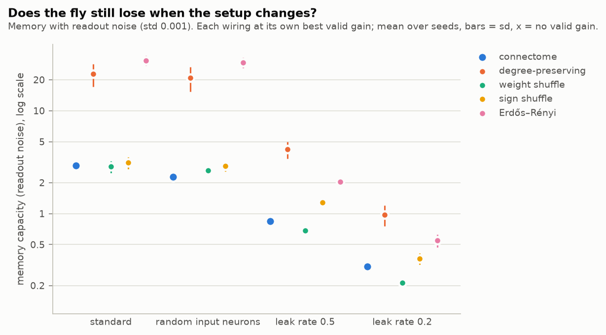
</p>

| best valid memory, readout noise | connectome | degree-preserving | weight shuffle | sign shuffle | Erdős–Rényi |
|---|---|---|---|---|---|
| whole CNS, standard | **2.9** | 22.8 | 2.9 | 3.1 | 30.8 |
| whole CNS, random input neurons | **2.3** | 21.0 | 2.6 | 2.9 | 29.5 |
| whole CNS, leak rate 0.5 | **0.8** | 4.2 | 0.7 | 1.3 | 2.0 |
| whole CNS, leak rate 0.2 | **0.3** | 1.0 | 0.2 | 0.4 | 0.6 |
| 3,000 neurons, standard | **6.7** | 6.0 | 7.4 | 4.3 | 7.1 |
| 3,000 neurons, random input neurons | **3.6** | 6.1 | 3.9 | 7.5 | 7.2 |
| 3,000 neurons, leak rate 0.5 | **4.9** | 2.9 | 5.1 | 2.2 | 3.3 |
| 3,000 neurons, leak rate 0.2 | **3.2** | 1.3 | 3.5 | 1.0 | 1.5 |

(3 seeds each. The standard rows are the gain sweep again.)

- **Where the input enters isn't why the fly loses; if anything it helped.** Across the whole brain,
  random input neurons change little (the fly 2.9 → 2.3, the two scrambled wirings 21 and 30) and the
  gap grows to 13×. In the small circuit they cost the two wirings with the fly's connections and
  real signs half their memory (6.7 → 3.6 and 7.4 → 3.9), while the scrambled wirings barely move:
  the small-circuit tie depended on the input entering through the sensory neurons.
- **Slow neurons remember less here, for every wiring.** A leaky neuron averages its recent inputs,
  and white-noise inputs averaged together are hard to pull apart again, all the more with readout
  noise. Across the whole brain every wiring ends up below 5 at leak 0.5 and around 1 or less at 0.2,
  and the fly stays behind the best control (5× and 3×), so there's little left to compare.
- **The one twist: slow neurons in the small circuit.** There the fly's connections with their real
  signs (connectome and weight shuffle) lose the least and end up ahead of both scrambled wirings
  (4.9 and 5.1 vs 2.9 and 3.3 at leak 0.5, 3.2 and 3.5 vs 1.3 and 1.5 at 0.2); shuffling the signs
  puts the same connections last. With leaky neurons they tolerate gains of 4 to 6 before latching,
  while the scrambled wirings do best near 1. It's the only setting in this project where the fly's
  wiring beats random wiring on memory with readout noise; it doesn't carry over to the whole brain,
  and on FlyWire only part of it holds (below).

### A second fly: FlyWire

Everything so far uses one connectome, from one male fly (the FlyWire runs use
`configs/flywire_*.yaml`). FlyWire's adult female brain differs in every way that could matter:
another animal and sex, another reconstruction pipeline, another transmitter classifier, and no
nerve cord (139,248 neurons). It goes through the identical pipeline: same code, settings, seeds and
3,000-neuron growth rule.

<p align="center">
  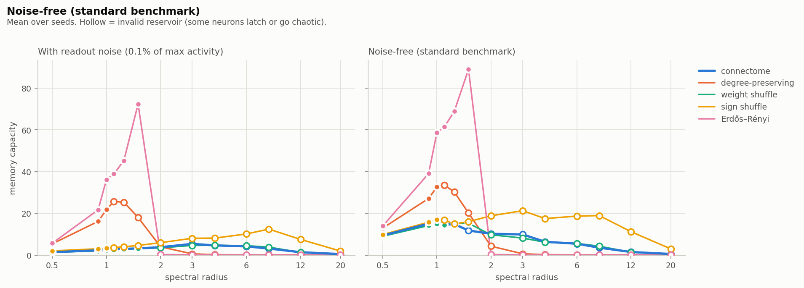
</p>

| best valid memory, readout noise (gain) | connectome | degree-preserving | weight shuffle | sign shuffle | Erdős–Rényi |
|---|---|---|---|---|---|
| male CNS, whole | **2.9** (1.25) | 22.8 (1) | 2.9 (1.1) | 3.1 (1) | 30.8 (8) |
| FlyWire, whole brain | **3.0** (1.25) | 21.8 (1) | 3.1 (1.5) | 3.3 (1) | 72.4 (1.5) |
| male CNS, 3,000 neurons | **6.7** (3) | 6.8 (12) | 7.4 (3) | 4.1 (1) | 7.2 (1) |
| FlyWire, 3,000 neurons | **4.8** (2) | 24.8 (1.25) | 3.8 (1.5) | 6.7 (1.25) | 41.5 (1.1) |

(3 seeds each.)

- **Same knots, in the same order.** FlyWire's largest eigenvalue is again an antennal-lobe knot:
  163 (against ~33 for its degree-preserving shuffle), 237 local and projection neurons. Next come
  the optic lobe (159, 154), the central brain (115) and the central complex (78, 73). In the male
  CNS: 251, then 206, 178, 173, …, 116.
- **Same whole-brain deficit.** At the standard gain only 1% of FlyWire's readouts move (79% in the
  degree-preserving shuffle), and the fly's memory is 2.3 against 16.1; in the male CNS it was 2.2
  against 16.1. At each wiring's best gain the fly reaches 3.0 against 22 and 72, and the three
  wirings with the fly's connections end up at 3.0 to 3.3, as in the male CNS (2.9 to 3.1).
- **The small-circuit tie doesn't replicate.** FlyWire's 3,000-neuron circuit, grown the same way
  from its most-connected sensory neurons, leaves the fly 5–9× behind even at its best gain (4.8 vs
  25 and 42). The tie was a property of the male CNS circuit, not of fly wiring.
- **Where FlyWire differs.** Erdős–Rényi does much better (72 vs 31 across the whole brain, 42 vs 7
  in the small circuit), with a large seed spread (±23 and ±14).
- **Robustness on FlyWire's small circuit.** Random input neurons leave the fly behind again (3.8
  vs 34.5). The slow-neuron twist only half holds: at leak 0.5 the fly draws level with the best
  control (9.1 vs 8.9), but only at a gain where it passes the latching tests while the gains around
  it fail (valid at 8, not at 4, 6 or 12), and the weight shuffle, with the same connections, never
  gets there; at leak 0.2 the fly is behind (2.0 vs 3.4). So that exception is fragile.

So: biological wiring isn't a better reservoir, and at brain scale it's a clearly worse one, whether
it gets one global gain, one per region or one per neuron, on both benchmarks, with the input moved
or the neurons slowed down, and in two independent fly connectomes.

### Volatility: a question with an answer

Returns are close to unpredictable; volatility isn't. `scripts/vol_forecast.py` puts a second readout
on the same reservoirs (same wiring, inputs and seeds as above) and forecasts the log realized
variance over the next 5 and 22 trading days, walk-forward on the same test days. The benchmark is
HAR (Corsi 2009), the standard model for this. Each reservoir's readout also sees the HAR features
and its own 5 inputs directly, so it contains the linear model *HAR + inputs* as a special case: the
gap between a reservoir and *HAR + inputs* is what the wiring adds.

<p align="center">
  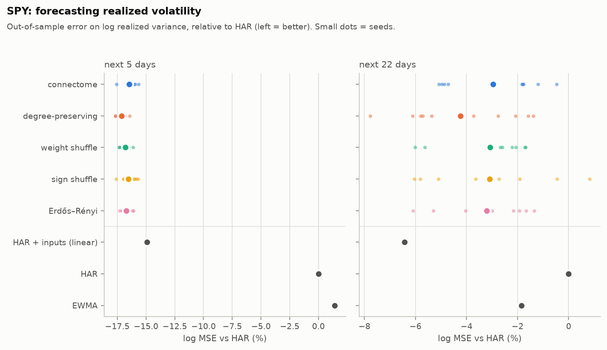
</p>

| whole CNS: log MSE vs HAR (R², log) | next 5 days | next 22 days |
|---|---|---|
| connectome | −16.5% (0.535) | −4.8% (0.446) |
| degree-preserving | −17.1% (0.539) | −6.0% (0.453) |
| weight shuffle | −16.8% (0.537) | −4.9% (0.446) |
| sign shuffle | −16.5% (0.536) | −4.9% (0.446) |
| Erdős–Rényi | −16.7% (0.537) | −5.0% (0.447) |
| HAR + inputs (linear) | −14.9% (0.527) | **−6.9% (0.458)** |
| HAR | 0% (0.444) | 0% (0.418) |
| EWMA | +1.4% (0.436) | −3.7% (0.439) |

- **Volatility is forecastable, and the biggest gain is linear.** HAR explains 44% of the variation
  in next week's log variance. Adding the reservoir's five inputs (recent returns, 20-day volatility
  and the vol-spike ratio) in a plain linear model cuts the error by another 15%, the largest
  forecasting improvement in this project, and no reservoir is involved.
- **The reservoir adds a little, at short horizons only.** Every wiring improves on HAR + inputs by
  2–3% at 5 days (Diebold–Mariano p ≤ 0.014 for all five) and not at all at 22 days, where the
  linear model is best.
- **The wiring barely matters.** The wirings are within about 1 point of each other (0.6 at 5 days,
  1.2 at 22), against 17% over HAR. At the standard gain the fly is 0.6% behind the
  degree-preserving shuffle at 5 days (consistent across seeds, p = 0.01, but tiny); with every
  wiring at its best gain it lands between the controls.
- **Memory helps only a little.** At the standard gain, reservoirs with more memory forecast slightly
  better at 5 days (Spearman ρ = −0.33 over 50 reservoirs, p = 0.02). With every wiring at its best
  gain, where memory ranges from 3 to 31, there's no relationship (15 reservoirs). The HAR features
  already carry a month of history, which leaves little for the reservoir's own memory to add.
- The 3,000-neuron circuit tells the same story (reservoirs −15.2% to −16.0% vs HAR at 5 days, HAR +
  inputs −14.2%). More memory goes with slightly lower error at both horizons (ρ = −0.37, p = 0.07 at
  5 days; −0.41, p = 0.04 at 22; 25 reservoirs), but at 22 days most reservoirs trail the linear
  model anyway, and with four such correlations tested that's weak evidence. One failure worth
  knowing: with every wiring at its best gain, one seed of the sign shuffle (gain 1.1) passes all
  its white-noise latching tests but blows up in the 2008 crash. From late October 2008 to March
  2009 it forecasts more than 200% annualized volatility, peaking in the thousands of percent, where
  its other seeds say about 45%. That one seed puts the sign shuffle's average below HAR (+15.7%).

Why log MSE and not QLIKE, the usual volatility loss: every log model here (HAR, HAR + inputs, the
reservoirs) is fitted for log MSE, so it compares them like for like. Log models target the mean of
log variance, not of variance, which can cost them on QLIKE: on simulated GARCH data, HAR fitted on
variance beats HAR fitted on logs on QLIKE (by a few percent at 5 days, 13–24% at 22 days), enough
to match or beat the reservoirs (on SPY they tie at 5 days, and the log version is ahead at 22). The
summaries report QLIKE too, with that HAR-on-variance as its reference. Before trusting any of this,
the forecasts were checked for lookahead: changing all prices after a date leaves every earlier
forecast identical.

<p align="center">
  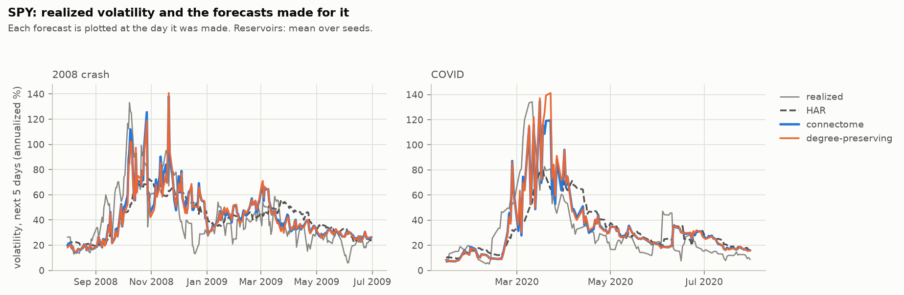
</p>

### What the fly does with the market

<p align="center">
  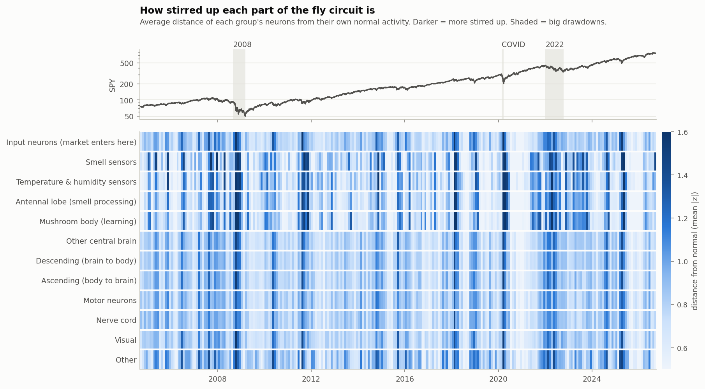
</p>

Every crash shows up as a dark band: 2008, the 2010 flash crash, August 2011, 2015, February 2018,
COVID, 2022, April 2025. In the worst months (October 2008, February 2018, March 2020) the average
moving neuron sits about twice as far from its normal activity as in a typical calm month; over the
three shaded crashes as a whole, about 30% further. Every group that moves reacts the same way.
Crashes raise variability rather than pushing groups up or down, which is why the figures show
distance from normal instead of raw activity. The circuit is grown outward from the fly's sensory
neurons, so it's mostly the smell pathway and what it feeds: olfactory receptor neurons, the
antennal lobe, 1,550 central-brain neurons and about 400 brain-to-body command neurons. Two groups
have no moving neurons at all: the mushroom body (the fly's learning center, 42 neurons here) and 56
visual neurons. Across the whole brain the same bands show up in every group that moves, but most of
it doesn't: 30–40% of the nerve cord, motor and ascending neurons move, 6% of the central brain,
under 1% of the visual system and the mushroom body, and none of the central complex ([whole-brain
version](docs/img/activity_heatmap_whole_cns.png)).

<p align="center">
  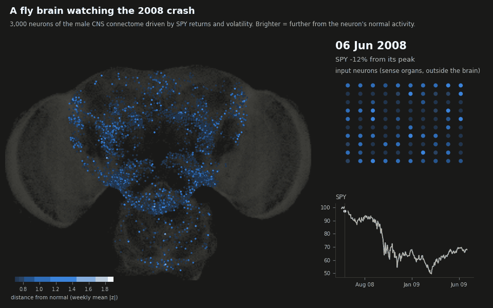
</p>

*The 3,000-neuron circuit through the 2008 crash ([COVID version](docs/img/brain_COVID.gif)).*

It also habituates. In the animation, October 2008 glows far brighter than the actual bottom in
March 2009. The inputs are measured against the trailing year: in October, volatility was 4.6
standard deviations above normal, while by March it was still 40% annualized but normal for a year
that had been all crisis. That adaptation comes from the input scaling, not from the fly's wiring.

## How it works

Reservoir computing: a fixed recurrent network turns an input time series into a
high-dimensional state that carries memory of the past plus nonlinear mixes of it. Only a
linear readout on top is trained.

```
x[t+1] = (1 - a) * x[t] + a * tanh(W x[t] + W_in u[t] + b)      # reservoir, never trained
ŷ[t]   = w_out · [u[t], x_R[t]]                                  # readout, ridge regression
```

- **W** = the connectome: synapse counts (log1p) between the selected neurons, signed by
  neurotransmitter under Dale's law (GABA and glutamate inhibitory as in Shiu et al. 2024, plus
  histamine; everything else excitatory), rescaled to spectral radius 0.9.
- **u[t]** = 5 market features (1/5/20-day returns, 20-day volatility, vol ratio), z-scored
  against a trailing window only. They enter through **sensory neurons** only.
- **x_R[t]** = states of randomly chosen neurons other than the input neurons (300 in the
  3,000-neuron circuit, 1,000 in the whole CNS).
- **Target** = next-day return divided by trailing volatility. Position = sign of the forecast,
  1 bp cost per unit of turnover.
- **Evaluation** = walk-forward: 3 years of history before the first forecast, readout refit every 6
  months (3 in the whole-CNS config) on an expanding window, ridge penalty picked on the last 20% of
  each training window. A model fitted on day t only trains on targets already known on day t
  (tested).

### Controls (same neurons, inputs and readouts; only W changes)

| wiring | keeps | scrambles |
|---|---|---|
| `connectome` | everything | nothing |
| `degree_preserving` | each neuron's in/out degree and outgoing weights | who connects to whom (reciprocity, motifs, modules) |
| `weight_shuffle` | exact topology | which connection has which synapse count |
| `sign_shuffle` | topology, weights, E/I ratio | which neurons are inhibitory |
| `erdos_renyi` | number of edges, weight distribution | all structure |

All controls are rescaled to the same spectral radius. For a given seed, every wiring gets the
same input weights, bias and readout neurons, so per-seed differences are paired comparisons.

### Baselines
Linear ridge on the same 5 features, AR ridge on 10 lagged returns, buy & hold. Same test days,
same fitting code.

### Market-free benchmarks
- **Memory capacity** (Jaeger 2001): feed white noise, train readouts to reconstruct the input
  from k steps ago, sum the R² over k. It shows how much input history each wiring keeps, which is
  a cleaner test of "is the wiring special" than noisy market returns. Reported twice: noise-free
  (the standard benchmark) and **with readout noise** (std 0.001, a thousandth of a neuron's
  maximum activity, added before fitting, `memory.readout_noise`). The noise-free readout rescales
  every neuron and can decode fluctuations of a millionth, which no physical system could carry. The
  noisy number counts only memory that is actually usable.
- **NARMA-10** (Atiya & Parlos 2000): predict y(t+1) = 0.3 y(t) + 0.05 y(t) Σᵢ y(t−i) +
  1.5 u(t−9) u(t) + 0.1 from a random input u. The product of inputs 9 steps apart needs memory
  *and* a nonlinearity, so a linear model of the last 10 inputs only gets NRMSE ≈ 0.60. Scored on
  held-out steps at every gain, like the gain sweep (`scripts/narma.py`), with the same readout noise
  as memory capacity (noise-free kept for reference).
- **Readout stability**: run the reservoir twice with inputs that differ only in the distant past.
  *Unstable readouts* end up in different states (they latched or went chaotic); a valid reservoir
  has none. Four such tests with different inputs, and the worst one counts
  (`memory.stability_tests`): near the edge a reservoir can latch for some inputs and not others,
  and a single test passes by luck surprisingly often. *Active readouts* are the ones whose state
  varies by more than 0.001. Both are reported per wiring in every summary, together with *top mode
  spread*: roughly how many neurons carry the largest eigenvalue.

## Setup

Linux (or macOS):

```bash
cd flybrain-reservoir
python3 -m venv .venv
.venv/bin/python -m pip install -e ".[dev]"
.venv/bin/python -m pytest
.venv/bin/python scripts/run_experiment.py --config configs/demo_synthetic.yaml
```

If `python3 -m venv` fails on Debian or Ubuntu, install the venv module first:
`sudo apt install python3-venv`. You can also `source .venv/bin/activate` once per terminal and
then just type `python`.

Windows (PowerShell):

```powershell
cd flybrain-reservoir
python -m venv .venv
.venv\Scripts\python -m pip install -e ".[dev]"
.venv\Scripts\python -m pytest
```

Calling the venv's Python directly skips `activate`, which PowerShell often blocks.

The tests run on synthetic data in about a minute. The demo runs the whole pipeline offline on a
fake connectome with a planted signal, just to prove everything works.

Notebooks in VS Code: open the `flybrain-reservoir` folder itself and pick the `.venv` kernel. If a
notebook still says `No module named 'flyres'`, run `%pip install -e "<full path to the repo>"` in a
cell and restart the kernel.

## Running it on the real brain

With the venv activated (`source .venv/bin/activate`), or with `.venv/bin/python` in place of
`python`:

```bash
python scripts/download_data.py        # ~1.2 GB from Janelia's public bucket, resumable
python scripts/build_connectome.py     # parse + cache the graph (a few minutes, once)
python scripts/run_experiment.py --config configs/small.yaml
python scripts/brain_activity.py --config configs/small.yaml
python scripts/gain_sweep.py --config configs/small.yaml     # each wiring at its own best gain
python scripts/hot_spots.py --config configs/small.yaml      # where the dominant eigenvalue lives
python scripts/region_gains.py --config configs/small.yaml   # each brain region its own gain
python scripts/homeostasis.py --config configs/small.yaml    # each neuron its own gain (homeostatic rule)
python scripts/narma.py --config configs/small.yaml          # NARMA-10 benchmark at every gain
python scripts/vol_forecast.py --config configs/small.yaml   # volatility forecasts, same reservoirs
python scripts/robustness.py --config configs/small.yaml    # random input neurons, leaky neurons
python scripts/report.py                                      # headline tables (results/small and results/full)
python scripts/scoreboard.py                                  # the summary chart at the top, from all runs
```

The FlyWire replication uses its own configs, identical except for the connectome (~130 MB of data,
from GitHub):

```bash
python scripts/download_data.py --source flywire
python scripts/hot_spots.py --config configs/flywire_full.yaml
python scripts/run_experiment.py --config configs/flywire_small.yaml
python scripts/gain_sweep.py --config configs/flywire_small.yaml
python scripts/gain_sweep.py --config configs/flywire_full.yaml --set reservoir.backend=torch
```

Results go to `results/small/`. Start with `summary.md`; the CSVs and `figures/` have the rest.
`brain_activity.py` writes the heatmap and animations of the 2008 and COVID crashes to
`results/small/brain/` (another window with `--window 2022-01-01 2022-10-31 --name 2022`; `--compare
degree_preserving` adds the rewired brain side by side, as in the animation at the top; `--replot`
redraws from the saved activity without simulating). `gain_sweep.py` writes
`results/small/gain_sweep/` (summary, CSVs, figure); `--gains` changes the grid (default: 13 gains
from 0.5 to 20). `region_gains.py` writes `results/small/region_gains/`; add `--set n_jobs=4` to use
more cores. `vol_forecast.py` writes `results/small/volatility/` (run it after `run_experiment.py`
so it can relate each reservoir's memory to its forecasts); `--best-gains` runs every wiring at its
best gain from the gain sweep instead, into `results/small/volatility_best_gain/`. `robustness.py`
writes `results/small/robustness/`; `--variants` picks which checks to run. `gain_sweep.py`,
`region_gains.py`, `homeostasis.py`, `narma.py` and `robustness.py` also take `--replot`, which
redraws the summary and figure from the saved CSVs without running anything.
`notebooks/01_connectome_tour.ipynb` explores the graph and its eigenvalue spectrum,
`notebooks/02_results.ipynb` runs and plots an experiment; `python scripts/run_notebooks.py` reruns
both in place, so their saved outputs match your data.

Override anything from the command line:

```bash
python scripts/run_experiment.py --config configs/small.yaml --set reservoir.spectral_radius=0.5 --set name=rho05
python scripts/run_experiment.py --config configs/small.yaml --set reservoir.normalize=frobenius --set reservoir.spectral_radius=0.5 --set name=frob
```

### Scaling up
- Subgraph size is just `subgraph.n_neurons`; everything is sparse, so 3k to 50k is a config change.
- `configs/full.yaml` runs the whole CNS (`method: all`) with 4 parallel jobs. Meant for a desktop
  (32 GB RAM is plenty). With the GPU backend on an RX 7900 XTX the experiment takes about 12
  minutes, the gain sweep about 6, NARMA-10 about 7, the per-region search about 35 and the
  homeostatic rule about 20, the volatility forecasts about 17 and the robustness checks about 20;
  CPU-only is slower. The animation at the top is `brain_activity.py
  --config configs/full.yaml --set reservoir.backend=torch --compare degree_preserving`; it
  simulates the whole CNS in blocks of 20,000 recorded neurons, so memory stays small.

### GPU (AMD on Linux)

The reservoir runs on the GPU through PyTorch (`reservoir.backend: torch`). AMD cards need
PyTorch's ROCm build, which only exists for Linux. Plain `pip install torch` gets the NVIDIA build
instead, so use the ROCm index:

```bash
.venv/bin/python -m pip install torch --index-url https://download.pytorch.org/whl/rocm7.2
```

(`rocm7.2` is current as of September 2026; pytorch.org's install selector shows the latest.)
These wheels bundle the ROCm libraries, so you only need the `amdgpu` kernel driver, which
mainstream distros ship, and access to the GPU device files:

```bash
sudo usermod -aG render,video $USER    # then log out and back in
```

Check it works (the second command runs the reservoir on the GPU and compares it with the CPU
version):

```bash
.venv/bin/python -c "import torch; print(torch.cuda.is_available(), torch.cuda.get_device_name(0))"
.venv/bin/python -m pytest tests/test_reservoir.py -k "torch or gpu" -v
```

ROCm GPUs show up as `cuda` in PyTorch, so nothing else changes. Then:

```bash
python scripts/run_experiment.py --config configs/full.yaml --set reservoir.backend=torch
```

The GPU only pays off for big reservoirs: at 3,000 neurons the CPU is already fast, while at the
full 166k each time step is a sparse multiply with ~6M connections, which is where the GPU wins.

## Design decisions (and why)

1. **Readout sees the raw inputs too.** A readout neuron only hears today's input one step later
   (it has to travel through W), so a states-only readout can't use the freshest information.
   On synthetic data with a planted signal, the states-only readout found almost nothing.
2. **Raw inputs are (almost) unpenalized in the ridge.** Then the reservoir model contains the
   linear model as a special case and the reservoir states act as a regularized correction.
   With one shared penalty, adding even 25 states made it *worse* than plain linear (slow,
   persistent regressors overfit noisy targets).
3. **Leak rate 1.0.** No per-neuron smoothing, so all memory has to come from the wiring, which is
   the thing being tested. Leaky neurons are checked separately (`robustness.py`).
4. **Equal spectral radius for every wiring, then gains tuned per wiring, region and neuron.** The
   main experiment uses the standard echo-state recipe: every wiring rescaled to spectral radius
   0.9. That's fair for random graphs, but the fly's largest eigenvalue sits on a small hot spot, so
   it gets turned down much harder than the controls. `gain_sweep.py` removes that bias by comparing
   each wiring at its own best valid gain. Matching total synaptic strength instead (`normalize:
   frobenius`) pushes the fly's cores past 1 so they latch; for per-neuron input normalization, see
   above. `region_gains.py` then gives every brain region its own gain on top, and `homeostasis.py`
   every neuron.
5. **Edges need ≥ 5 synapses.** Standard threshold to drop noisy connections
   (`connectome.min_weight`).
6. **Inputs = the most-connected sensory neurons**, and the subgraph is grown from them by
   repeatedly adding the neurons most strongly connected to it, so the signal can actually
   propagate. `subgraph.input_filter` can pick one modality, e.g. `{class: olfactory}`; the
   robustness check feeds the input into random neurons instead.

## Reading the numbers

- A model that learns nothing predicts the average return, which is positive, so it turns into
  buy & hold. Compare Sharpe against buy & hold and hit rate against the up-day rate; IC is the
  cleanest skill measure.
- p-values come from paired tests over seeds. Several comparisons run at once, so expect the odd
  p < 0.05 by chance; the memory gaps (with readout noise) between the fly and the two scrambled
  wirings (p < 0.001) survive that. The fly vs weight and sign shuffle differences are small.

### Limitations
- Rate model, not spiking. A leaky integrate-and-fire version is the obvious next step.
- The sign rule is an approximation (glutamate isn't inhibitory everywhere, neuromodulators are
  treated as excitatory, "unclear" transmitters default to excitatory).
- The hot spots depend on the neurotransmitter labels, which are mostly *predictions* from the
  dataset. The antennal-lobe core is labeled mostly excitatory; if more of it is actually
  inhibitory, it is less explosive than modeled here.
- Gains are tried globally, per brain region and per neuron. The region search is a local
  coordinate search and the per-neuron rule doesn't always settle, both over 3 seeds, so neither is
  a global optimum. Real brains also tune excitability with neuromodulators that depend on what the
  animal is doing, which nothing here models.
- The readout noise level (std 0.001) is a judgment call. It changes the small-circuit
  verdict at best gains (fly's connections slightly ahead noise-free, a tie with noise), not the
  whole-brain one.
- Realized variance comes from daily squared returns, the only thing daily closes allow. That proxy
  is noisy; with intraday (5-minute) data every volatility model would be more precise and HAR harder
  to beat.
- Across the whole brain, two benchmarks (memory capacity and NARMA-10) rank the wirings the same
  way; in the small circuit, NARMA barely separates them. Other tasks, such as predicting a chaotic
  time series, could still rank them differently.
- The leaky variants keep the standard input scaling and readout noise. Retuning both for slow
  neurons could raise every wiring's memory; all wirings get the same setup, so the comparison stays
  paired.
- Two connectomes, both of single animals: a male CNS and a female brain. The FlyWire one has no
  nerve cord, and its connectivity comes from the pair table published with Shiu et al. 2024 rather
  than FlyWire's own release files. It has exactly the 2,700,513 connections of at least 5 synapses
  that the FlyWire paper reports; the 84 that involve a neuron missing from the annotation table are
  dropped.

## Repo layout

```
src/flyres/
  connectome.py   download, parse and cache the male CNS or FlyWire  (W[post, pre] = synapse count)
  subgraph.py     choose the reservoir neurons (grow from sensory neurons, top degree, or all)
  controls.py     null-model wirings
  reservoir.py    echo state network (numpy/scipy or torch)
  market.py       prices -> causal features and targets
  readout.py      ridge regression and walk-forward refits
  metrics.py      IC, hit rate, Sharpe, drawdown, block bootstrap
  config.py       every setting, with defaults (the YAML configs override them)
  benchmarks.py   memory capacity, readout stability (active / unstable readouts)
  diagnostics.py  where the dominant eigenvalue lives, hot-spot cascade
  sweep.py        gain sweep: each wiring at its own best valid gain
  regions.py      per-region gains: anatomical regions, coordinate search for each region's factor
  homeostasis.py  per-neuron gains from synaptic scaling toward a target input size
  narma.py        NARMA-10 benchmark: memory plus nonlinearity, at every gain
  robustness.py   gain sweep with random input neurons or leaky neurons
  scoreboard.py   every memory result in one table: the fly vs the best random rewiring
  volatility.py   realized-volatility forecasts: HAR benchmarks, reservoir readouts, DM tests
  activity.py     neuron groups, activity relative to normal, soma positions
  experiment.py   runs everything and writes results
  plotting.py     figures and the brain animations
  synthetic.py    fake data for tests and the offline demo
scripts/          download_data.py, build_connectome.py, run_experiment.py, brain_activity.py,
                  gain_sweep.py, hot_spots.py, region_gains.py, homeostasis.py, narma.py,
                  robustness.py, vol_forecast.py, report.py, scoreboard.py, run_notebooks.py
configs/          small.yaml (laptop), full.yaml (whole CNS), flywire_small.yaml and
                  flywire_full.yaml (the replication), demo_synthetic.yaml (offline)
notebooks/        01_connectome_tour.ipynb, 02_results.ipynb
docs/img/         figures used in this README
tests/            pytest suite (no downloads needed)
```

## Data and credits

- Male CNS v1.0 connectome: FlyEM (HHMI Janelia), University of Cambridge, MRC LMB and Google
  Research, <https://male-cns.janelia.org>, licensed CC-BY 4.0. Cite the dataset paper listed on
  the project site if you use it. The figures in `docs/img` are derived from it.
- FlyWire connectome, release 783: FlyWire Consortium, licensed CC-BY 4.0. Dorkenwald et al. 2024,
  *Neuronal wiring diagram of an adult brain*, Nature; annotations from Schlegel et al. 2024,
  *Whole-brain annotation and multi-connectome cell typing of Drosophila*, Nature
  ([flyconnectome/flywire_annotations](https://github.com/flyconnectome/flywire_annotations));
  transmitter predictions from Eckstein et al. 2024, Cell; the per-pair connectivity table from
  [philshiu/Drosophila_brain_model](https://github.com/philshiu/Drosophila_brain_model).
- Sign rule: Shiu et al. 2024, *A Drosophila computational brain model reveals sensorimotor
  processing*, Nature.
- Memory capacity: Jaeger 2001, *Short term memory in echo state networks*.
- NARMA-10: Atiya & Parlos 2000, *New results on recurrent network training*, IEEE Transactions on
  Neural Networks; as an echo state benchmark, Jaeger 2003, *Adaptive nonlinear system
  identification with echo state networks*, NIPS.
- Degree-preserving rewiring: Maslov & Sneppen 2002, *Specificity and stability in topology of
  protein networks*, Science.
- Synaptic scaling: Turrigiano et al. 1998, *Activity-dependent scaling of quantal amplitude in
  neocortical neurons*, Nature.
- Volatility: Corsi 2009, *A simple approximate long-memory model of realized volatility* (HAR);
  Patton 2011, *Volatility forecast comparison using imperfect volatility proxies* (QLIKE); Diebold
  & Mariano 1995, *Comparing predictive accuracy*.
- File schema cross-checked against [sstamou03/fly_brain](https://github.com/sstamou03/fly_brain).
