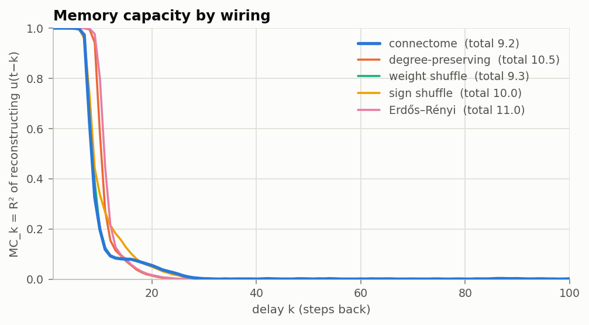

# flybrain-reservoir

**Does a real fruit fly brain make a better forecasting machine than random wiring?**

<p align="center">
  
</p>

*3,000 neurons of the fly's sensory circuitry (mostly the smell pathway), wired exactly as in the
male CNS connectome and driven by SPY returns and volatility through its sensory neurons. Brighter = further
from that neuron's normal activity. It reacts to the crash; it doesn't see it coming.
([COVID version](docs/img/brain_COVID.gif))*

This project uses the wiring diagram of the adult male *Drosophila* central nervous system
(166,700 neurons, released in 2026 by FlyEM/HHMI Janelia with Google Research) as the recurrent
network of an echo state network, feeds it market data, and compares it against control
networks that keep some of its statistics and scramble the rest.

The goal isn't to beat the market with a fly. It's a clean answer to a narrower question: *is
biological wiring special as a reservoir, compared to random wiring with matching statistics?*

## Results so far

3,000-neuron circuit, SPY daily, out of sample Sep 2007 to Sep 2026, 5 seeds (`configs/small.yaml`).

- **Markets: no edge, and the wiring doesn't matter.** Every reservoir has an IC around 0.015
  (t ≈ 1), a hit rate around 53.5% against 54.9% for always being long, and a Sharpe of about 0.5
  against 0.62 for buy & hold. Connectome vs each control: p between 0.17 and 0.98. The equity
  curve's lead over buy & hold comes entirely from sidestepping 2008.
- **Memory: the real wiring remembers less than random wiring.** Memory capacity 9.2 for the
  connectome vs 10.5 for the degree-preserving shuffle and 11.0 for Erdős–Rényi (both p < 0.001).
  Shuffling only the synapse strengths changes nothing (9.3), so it's about who connects to whom.
- **Why:** the fly is full of reciprocal loops (reciprocity 0.36 vs 0.04 after shuffling). They
  create a few dominant modes: its largest eigenvalue is ~4x the shuffle's (252 vs 65). Rescale
  every wiring to the same spectral radius and the rest of the fly's spectrum gets squashed
  (median |λ| 0.03 vs 0.20 for the shuffle), so its activity dies out faster. The gap holds at
  every spectral radius from 0.5 to 0.99.
- **No escape hatch through normalization:** giving every wiring the same total synaptic strength
  instead (`normalize: frobenius`) pushes the fly's top eigenvalue to ~5, and it stops forgetting
  its starting point (some neurons latch), so that comparison isn't valid. Every run now checks
  this and flags it.

<p align="center">
  
</p>

### What the fly does with the market

<p align="center">
  
</p>

Every crash shows up as a dark band: 2008, the 2010 flash crash, August 2011, 2015, February 2018,
COVID, 2022. In crash months the average neuron sits roughly twice as far from its normal
activity as in calm months, in every part of the circuit. Crashes raise variability rather than
pushing groups up or down, which is why the figures show distance from normal instead of raw
activity. The circuit is mostly the fly's smell pathway: olfactory receptor neurons, the
antennal lobe, the mushroom body (its learning center) and about 400 brain-to-body command neurons.

It also habituates. In the animation, October 2008 glows far brighter than the actual bottom in
March 2009. The inputs are measured against the trailing year: in October, volatility was 4.6
standard deviations above normal, while by March it was still 40% annualized but normal for a year
that had been all crisis. That adaptation comes from the input scaling, not from the fly's wiring.

## How it works

Reservoir computing: a fixed recurrent network turns an input time series into a
high-dimensional state that carries memory of the past plus nonlinear mixes of it. Only a
linear readout on top is trained.

```
x[t+1] = (1 - a) * x[t] + a * tanh(W x[t] + W_in u[t] + b)      # reservoir, never trained
ŷ[t]   = w_out · [u[t], x_R[t]]                                  # readout, ridge regression
```

- **W** = the connectome: synapse counts (log1p) between the selected neurons, signed by
  neurotransmitter under Dale's law (GABA, glutamate, histamine inhibitory, everything else
  excitatory, the rule from Shiu et al. 2024), rescaled to spectral radius 0.9.
- **u[t]** = 5 market features (1/5/20-day returns, 20-day volatility, vol ratio), z-scored
  against a trailing window only. They enter through **sensory neurons** only.
- **x_R[t]** = states of 300 randomly chosen non-sensory neurons.
- **Target** = next-day return divided by trailing volatility. Position = sign of the forecast,
  1 bp cost per unit of turnover.
- **Evaluation** = walk-forward: 3 years of history before the first forecast, readout refit
  every 6 months on an expanding window, ridge penalty picked on the last 20% of each training
  window. A model fitted on day t only trains on targets already known on day t (tested).

### Controls (same neurons, inputs and readouts; only W changes)

| wiring | keeps | scrambles |
|---|---|---|
| `connectome` | everything | nothing |
| `degree_preserving` | each neuron's in/out degree and outgoing weights | who connects to whom (reciprocity, motifs, modules) |
| `weight_shuffle` | exact topology | which connection has which synapse count |
| `sign_shuffle` | topology, weights, E/I ratio | which neurons are inhibitory |
| `erdos_renyi` | number of edges, weight distribution | all structure |

All controls are rescaled to the same spectral radius. For a given seed, every wiring gets the
same input weights, bias and readout neurons, so per-seed differences are paired comparisons.

### Baselines
Linear ridge on the same 5 features, AR ridge on 10 lagged returns, buy & hold. Same test days,
same fitting code.

### Market-free benchmarks
- **Memory capacity** (Jaeger 2001): feed white noise, train readouts to reconstruct the input
  from k steps ago, sum the R² over k. It shows how much input history each wiring keeps, which is
  a cleaner test of "is the wiring special" than noisy market returns.
- **Echo gap**: run the reservoir twice with inputs that differ only in the distant past. A valid
  reservoir ends up in the same state both times (gap ≈ 0). Reported per wiring in every summary.

## Setup

Linux (or macOS):

```bash
cd flybrain-reservoir
python3 -m venv .venv
.venv/bin/python -m pip install -e ".[dev]"
.venv/bin/python -m pytest
.venv/bin/python scripts/run_experiment.py --config configs/demo_synthetic.yaml
```

If `python3 -m venv` fails on Debian or Ubuntu, install the venv module first:
`sudo apt install python3-venv`. You can also `source .venv/bin/activate` once per terminal and
then just type `python`.

Windows (PowerShell):

```powershell
cd flybrain-reservoir
python -m venv .venv
.venv\Scripts\python -m pip install -e ".[dev]"
.venv\Scripts\python -m pytest
```

Calling the venv's Python directly skips `activate`, which PowerShell often blocks.

The tests run on synthetic data in about 15 seconds. The demo runs the whole pipeline offline on a
fake connectome with a planted signal, just to prove everything works.

Notebooks in VS Code: open the `flybrain-reservoir` folder itself and pick the `.venv` kernel. If a
notebook still says `No module named 'flyres'`, run `%pip install -e "<full path to the repo>"` in a
cell and restart the kernel.

## Running it on the real brain

With the venv activated (`source .venv/bin/activate`), or with `.venv/bin/python` in place of
`python`:

```bash
python scripts/download_data.py        # ~1.2 GB from Janelia's public bucket, resumable
python scripts/build_connectome.py     # parse + cache the graph (a few minutes, once)
python scripts/run_experiment.py --config configs/small.yaml
python scripts/brain_activity.py --config configs/small.yaml
```

Results go to `results/small/`. Start with `summary.md`; the CSVs and `figures/` have the rest.
`brain_activity.py` writes the heatmap and the animation to `results/small/brain/` (pick another
crash with `--window 2020-01-01 2020-08-31 --name COVID`). `notebooks/01_connectome_tour.ipynb`
explores the graph and its eigenvalue spectrum, `notebooks/02_results.ipynb` runs and plots an
experiment.

Override anything from the command line:

```bash
python scripts/run_experiment.py --config configs/small.yaml --set reservoir.spectral_radius=0.5 --set name=rho05
python scripts/run_experiment.py --config configs/small.yaml --set reservoir.normalize=frobenius --set reservoir.spectral_radius=0.5 --set name=frob
```

### Scaling up
- Subgraph size is just `subgraph.n_neurons`; everything is sparse, so 3k to 50k is a config change.
- `configs/full.yaml` runs the whole CNS (`method: all`) with 4 parallel jobs. Meant for a
  desktop (32 GB RAM is plenty); expect roughly an hour.

### GPU (AMD on Linux)

The reservoir runs on the GPU through PyTorch (`reservoir.backend: torch`). AMD cards need
PyTorch's ROCm build, which only exists for Linux. Plain `pip install torch` gets the NVIDIA build
instead, so use the ROCm index:

```bash
.venv/bin/python -m pip install torch --index-url https://download.pytorch.org/whl/rocm7.2
```

(`rocm7.2` is current as of September 2026; pytorch.org's install selector shows the latest.)
These wheels bundle the ROCm libraries, so you only need the `amdgpu` kernel driver, which
mainstream distros ship, and access to the GPU device files:

```bash
sudo usermod -aG render,video $USER    # then log out and back in
```

Check it works (the second test runs the reservoir on the GPU and compares it with the CPU version):

```bash
.venv/bin/python -c "import torch; print(torch.cuda.is_available(), torch.cuda.get_device_name(0))"
.venv/bin/python -m pytest tests/test_reservoir.py -k "torch or gpu" -v
```

ROCm GPUs show up as `cuda` in PyTorch, so nothing else changes. Then:

```bash
python scripts/run_experiment.py --config configs/full.yaml --set reservoir.backend=torch
```

The GPU only pays off for big reservoirs: at 3,000 neurons the CPU is already fast, while at the
full 166k each time step is a sparse multiply with ~6M connections, which is where the GPU wins.

## Design decisions (and why)

1. **Readout sees the raw inputs too.** A readout neuron only hears today's input one step later
   (it has to travel through W), so a states-only readout can't use the freshest information.
   On synthetic data with a planted signal, the states-only readout found almost nothing.
2. **Raw inputs are (almost) unpenalized in the ridge.** Then the reservoir model contains the
   linear model as a special case and the reservoir states act as a regularized correction.
   With one shared penalty, adding even 25 states made it *worse* than plain linear (slow,
   persistent regressors overfit noisy targets).
3. **Leak rate 1.0.** No per-neuron smoothing, so all memory has to come from the wiring, which is
   the thing being tested. Leaky neurons add memory that has nothing to do with W.
4. **Equal spectral radius for every wiring.** The standard echo-state recipe: same overall gain,
   and every wiring stays a valid reservoir. The catch is that the fly's biggest eigenvalue is an
   outlier, so matching it squashes the rest of its spectrum; that's the finding above, not a bug.
   The alternative (same total synaptic strength) overdrives the fly until it latches.
5. **Edges need ≥ 5 synapses.** Standard threshold to drop noisy connections (`connectome.min_weight`).
6. **Inputs = the most-connected sensory neurons**, and the subgraph is grown from them by
   repeatedly adding the neurons most strongly connected to it, so the signal can actually
   propagate. `subgraph.input_filter` can pick one modality, e.g. `{class: olfactory}`.

## Reading the numbers

- A model that learns nothing predicts the average return, which is positive, so it turns into
  buy & hold. Compare Sharpe against buy & hold and hit rate against the up-day rate; IC is the
  cleanest skill measure.
- The standard error of an annualized Sharpe over ~19 years is about 0.23. Small differences are noise.
- p-values come from paired tests over seeds. Several comparisons run at once, so expect the odd
  p < 0.05 by chance; the memory-capacity gaps (p < 0.001) survive that.

### Limitations
- Rate model, not spiking. A leaky integrate-and-fire version is the obvious next step.
- The sign rule is an approximation (glutamate isn't inhibitory everywhere, neuromodulators are
  treated as excitatory, "unclear" transmitters default to excitatory).
- One 3,000-neuron circuit grown from the sensory side; other parts of the brain, or the whole CNS
  (`configs/full.yaml`), could behave differently.

## Repo layout

```
src/flyres/
  connectome.py   download, parse and cache the male CNS  (W[post, pre] = synapse count)
  subgraph.py     choose the reservoir neurons (grow from sensory neurons, top degree, or all)
  controls.py     null-model wirings
  reservoir.py    echo state network (numpy/scipy or torch)
  market.py       prices -> causal features and targets
  readout.py      ridge regression and walk-forward refits
  metrics.py      IC, hit rate, Sharpe, drawdown, block bootstrap
  benchmarks.py   memory capacity, echo gap
  activity.py     neuron groups, activity relative to normal, soma positions
  experiment.py   runs everything and writes results
  plotting.py     figures and the brain animation
  synthetic.py    fake data for tests and the offline demo
scripts/          download_data.py, build_connectome.py, run_experiment.py, brain_activity.py
configs/          small.yaml (laptop), full.yaml (whole CNS), demo_synthetic.yaml (offline)
notebooks/        01_connectome_tour.ipynb, 02_results.ipynb
docs/img/         figures used in this README
tests/            pytest suite (no downloads needed)
```

## Data and credits

- Male CNS v1.0 connectome: FlyEM (HHMI Janelia), University of Cambridge, MRC LMB and Google
  Research, <https://male-cns.janelia.org>, licensed CC-BY 4.0. Cite the dataset paper listed on
  the project site if you use it. The figures in `docs/img` are derived from it.
- Sign rule: Shiu et al. 2024, *A Drosophila computational brain model reveals sensorimotor
  processing*, Nature.
- Memory capacity: Jaeger 2001, *Short term memory in echo state networks*.
- Degree-preserving rewiring: Maslov & Sneppen 2002, *Specificity and stability in topology of protein networks*, Science.
- File schema cross-checked against [sstamou03/fly_brain](https://github.com/sstamou03/fly_brain).
